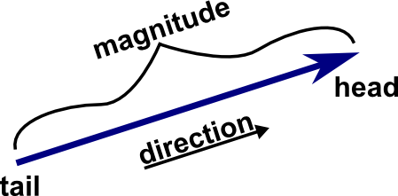

# test2

Review for CSIS10A test #2

For these problems you will be working alone. This is an open book test.

Clone this repository from GitHub. This project uses Maven to run the examples.

## Problem 1 - Vector Magnitude

When working in 3D graphics, you will often use vectors to describe the
orientation of an object. A 3D vector is represented by 3 values: x, y,
and z:

| |  |
| --- | --- |
|||

In this problem, you will create a class with a static method that
calculates the length or *magnitude* of a vector. The magnitude is often
called the *norm*. The magnitude of a vector is the square root of the
sum of the squares of each element. For a 3D vector that could be
written as:


Remember, you can use the methods in Java\'s Math class:
<https://docs.oracle.com/en/java/javase/21/docs/api/java.base/java/lang/Math.html>

Do the following:

1. Create a class called `VectorNorm` in the directory `src/main/java`
2. Create a static method called `norm` that has 3 parameters: x, y,
    and z. You need to choose the appropriate types for the parameters.
    This method will return the value of the magnitude.
3. Create a main method in `VectorNorm` to test your magnitude method.
4. Use the following values to test your method: `x = 2, y = 3, z = 4`. You can use the command `mvn exec:java "-Dexec.mainClass=VectorNorm"` to run your test.

## Problem 2 - String manipulation

To assist you, the javadocs for String are located at
<https://docs.oracle.com/en/java/javase/21/docs/api/java.base/java/lang/String.html>

Do the following:

1. Create a class called `ReverseString` in the directory `src/main/java`
2. Create 2 static methods called `reverse1` and `reverse2` that have a String as a parameter and return a String. Each of these methods will return a string that is reversed. (e.g. if you pass in \"Schlining\" it will return \"gninilhcS\"). Each method will used a different technique to reverse the String. Implement these methods using 1) a `while` loop, 2) recursion.
3. Create a main method in `ReverseString` to test your implementations. You can use the command `mvn exec:java "-Dexec.mainClass=ReverseString"` to run your test.

## Problem 3 - Modify a Point2D object

JavaFX provides an immutable class called Point2D to represent a
location. The javadocs for Point2D are located at
<https://openjfx.io/javadoc/21/javafx.graphics/javafx/geometry/Point2D.html>.
Your task is to create a method that accepts a Point2D object and an x and y offset. The method returns a *new* Point2D object that is offset by x and y from the original Point2D object.

Do the following:

1. Create a class called `PointMover`
2. Create a static method called `move` that accepts the needed
    parameters. It will return a Point2D object.
3. Implement move
4. Create a main method to test your implementations. Try the following
    inputs: (1) `new Point2D(0, 0), x = 1, y = 2` and (2) `new Point2D(1,
    2), x = 10, y = 100`
5. You can run you class using `mvn exec:java "-Dexec.mainClass=PointMover"`

## Problem 4 - Override a method

In this problem, you will create your own class that overrides a method.
You will start with a simple class that wraps a String and provides a
display method that prints the wrapped String.

Do the following:

1. In `src/main/java`, there is the file  `MyString.java` containing the following code:

```java
public class MyString {

    private String s;
    
    public MyString(String s) {
        this.s = s;
    }

    public String getString() {
        return s;
    }

    public void display() {
        System.out.println(getString());
    }

}
```

2. Create a new class in `src/main/java` called `ShortString` that extends `MyString`

3. In `ShortString`, **override** the `display` method so that it only prints the first and last characters of the wrapped string value, `s`. Make sure ShortString works when it wraps **null** values.

4. Create another class called `ShortStringTest` that contains a main method that tests `ShortString`. You can run it from the command line using `mvn exec:java "-Dexec.mainClass=ShortStringTest"`

## Problem 5 - Drawing with JavaFX A

For reference, the javadoc for GraphicsContext is located at <https://openjfx.io/javadoc/21/javafx.graphics/javafx/scene/canvas/GraphicsContext.html>. Just a reminder that you can use GraphicsContext to stroke (i.e. draw) or fill. The method you will need for this problem is [strokeLine](https://openjfx.io/javadoc/21/javafx.graphics/javafx/scene/canvas/GraphicsContext.html#strokeLine(double,double,double,double)).

**READ ALL THE STEPS BEFORE STARTING!** Do the following:

1. In `src/main/java` there is the stub class, PlusSigns.java. Your goal is to create the following pluses. Note that you are not drawing the coordinate labels, they are there just to inform you of the location and size of the plus signs.


2. Create a method `drawPlus` that takes 3 arguments, a `GraphicContext` and the x and y coordinates of the center of the plus. This method will draw the plus.
3. In the draw method in `PlusSigns.java`, use your `drawPlus` method to create the pluses as shown in the picture above. You can run your class using `mvn exec:java "-Dexec.mainClass=PlusSigns"`

## Problem 5 - Drawing with JavaFX B

For reference, the javadoc for GraphicsContext is located at
<https://openjfx.io/javadoc/21/javafx.graphics/javafx/scene/canvas/GraphicsContext.html>.
Just a reminder that you can use GraphicsContext to *stroke* (i.e. draw)
or *fill*. Methods of interest for this problem include
[strokeLine](https://openjfx.io/javadoc/21/javafx.graphics/javafx/scene/canvas/GraphicsContext.html#strokeLine(double,double,double,double)), [setFill](https://openjfx.io/javadoc/21/javafx.graphics/javafx/scene/canvas/GraphicsContext.html#setFill(javafx.scene.paint.Paint)) and [fillOval](https://openjfx.io/javadoc/21/javafx.graphics/javafx/scene/canvas/GraphicsContext.html#fillOval(double,double,double,double)). **Note that the canvas you are
drawing on is 300 by 300 pixels.**

Do the following:

1. In `src/main/java` there is the stub class, TicTacToe.java, listed below. Create the following graphic using the methods of GraphicContext. You can run it from the command line using `mvn exec:java "-Dexec.mainClass=TicTacToe"`.

    

```java
import javafx.application.Application;
import javafx.scene.canvas.Canvas;
import javafx.scene.canvas.GraphicsContext;
import javafx.scene.layout.BorderPane;
import javafx.scene.paint.Color;
import javafx.scene.Scene;
import javafx.scene.shape.Polygon;
import javafx.scene.shape.Rectangle;
import javafx.stage.Stage;


public class TicTacToe extends Application {

    public static void main(String[] args) {
        launch(args);
    }

    @Override
    public void start(Stage stage) throws Exception {
        stage.setTitle(getClass().getSimpleName());

        // Use Border pane to center content
        BorderPane pane = new BorderPane();
        Canvas canvas = new Canvas(300, 300);
        pane.setCenter(canvas);
        GraphicsContext graphicsContext = canvas.getGraphicsContext2D();
        graphicsContext.setFill(Color.GRAY);
        draw(graphicsContext);
        stage.setScene(new Scene(pane));
        stage.show();
    }
    
    private void draw(GraphicsContext g) {
      Color red = Color.RED;
      Color black = Color.BLACK;
      // YOUR CODE GOES HERE
    }
    
}
```
